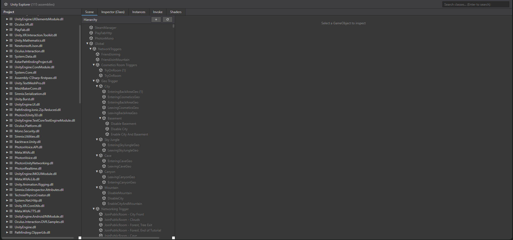

    
    <h1 align="center">BNM Explorer</h1>
    
A web-based runtime inspector and debugger for IL2CPP Unity games on Android.

    <a href="https://github.com/SilentErased/BNMExplorer/releases/latest"><b>✦︎ Download latest release ✦︎</b></a>

 

    

### **Features**
- **Web-Based UI**: Accessible via any web browser on your PC or phone. No heavy desktop client required.
- **Assembly Explorer**: Browse loaded assemblies, namespaces, classes, methods, and fields in a `dnSpy`-like interface.
- **Scene Hierarchy**: Real-time view of the Unity Scene. Create, delete, and manage GameObjects dynamically.
- **Inspector**: 
  - Edit `Transform` (Position, Rotation, Scale).
  - View and modify public/private fields and properties.
  - Supports `int`, `float`, `bool`, `string`, `Vector3`, `Color` and more.
- **Method Invoker**: Call static or instance methods directly from the browser with custom arguments.
- **Instance Tracking**: Find live instances of any class in memory.
- **Component System**: Add or remove components at runtime.

### **Key Advantages**
BNM Explorer runs an embedded HTTP server directly inside the game process. This means you can debug Android games wirelessly or via USB without complex setups. It bridges the gap between static analysis and runtime modification, powered by **BNM (ByNameModding)** and **BNM-Resolve**.

### **Requirements**
- Patch game and insert our native mod
